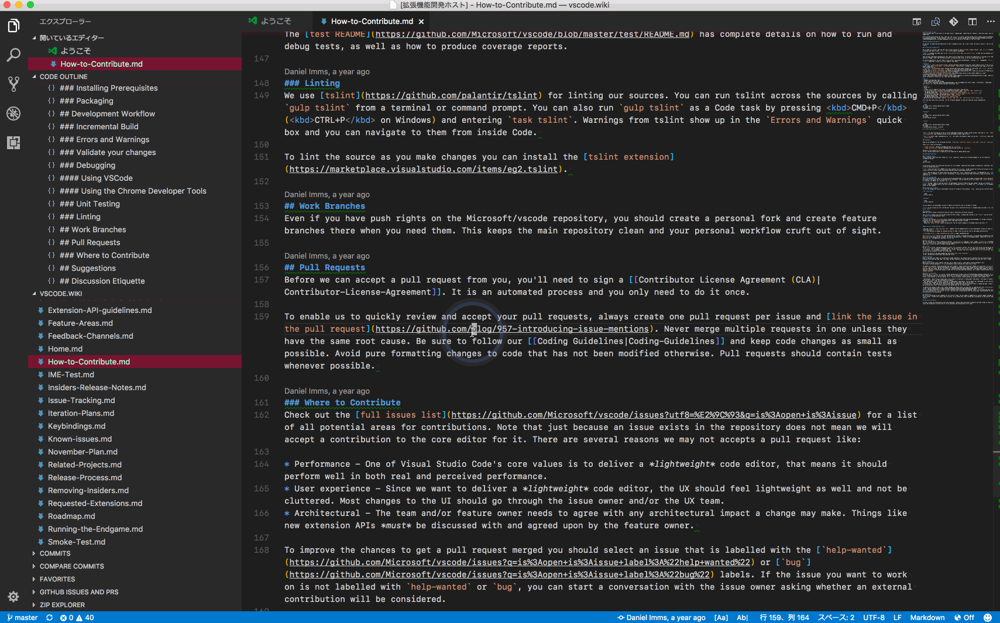

# vscode-translate-hover


> 注意: 本拡張は **AI coding の実験**として開発しています。挙動や API 仕様の変更等により期待どおりに動作しない場合があります。

VS Code で **選択したテキストを翻訳し、ホバーに表示**する拡張機能です。翻訳エンジンは **Google 翻訳** または **OpenAI API** を選べます。



---

## 機能

- 選択テキストの翻訳結果をホバー表示
- 翻訳結果のペースト（`cmd/ctrl + shift + T`）
- クリップボードのテキストを翻訳して QuickPick に表示（Enter で翻訳結果をクリップボードにコピー）
- **デバウンス**（既定 300ms）と **キャッシュ**（LRU、最大30件）
- **自動言語検出**（`auto-ja` / `auto-en` / `auto-zh`）
  - `regex`（高速・無料）/ `llm`（高精度・OpenAI のみ）の 2方式
- Google 翻訳（プロキシ設定 `http.proxy` を考慮）
- OpenAI 翻訳（カスタム Base URL、reasoning_effort、モデル名表示）
- 専用ログ出力チャネル（「ログ出力チャネルを表示」コマンド）

---

## クイックスタート

1. エディタ上で任意の文字列を選択
2. 選択範囲にマウスカーソルを乗せると翻訳結果がホバー表示されます
3. 必要に応じて以下でペーストできます
   - キーバインド: Windows/Linux `ctrl+shift+t` / macOS `cmd+shift+t`
   - またはホバー内の「翻訳をペースト」リンク

## 要件

- VS Code: `^1.85.0`
- Google 翻訳利用時はネットワーク接続が必要です
- OpenAI 利用時は API キーが必要です

---

## コマンド

| コマンド | 説明 |
|---|---|
| `extension.translatePaste` | 直近の翻訳結果をエディタへペースト |
| `extension.translateClipboardQuickPick` | クリップボードのテキストを翻訳し、QuickPick に表示（Enter でコピー） |
| `extension.showLogs` | ログ出力チャネルを表示 |

---

## プライバシー/送信データ

- **選択したテキストのみ**が翻訳のために外部サービス（Google/OpenAI）へ送信されます。ファイル名、ファイルパス、周辺テキストや編集履歴などの追加メタデータは送信されません。
- 送信が発生するタイミング:
  - エディタでテキストを選択してホバーした際（デフォルトで約300ms のデバウンス後に自動で翻訳リクエストが送信されます）
  - 「クリップボードを翻訳」コマンド実行時（クリップボードの内容が送信されます）
  - LLM ベースの言語検出を有効にしている場合（OpenAI を使用）、検出のために選択テキストが送信されます
- 起動時の事前チェック: OpenAI の system-role サポート判定のため、短いテストリクエスト（固定文字列）を構成されたモデルへ送信することがあります（ユーザー選択テキストは含まれません）。
- ログについて: `translateHover.enableDebugLogging` を有効にするとデバッグログに選択テキストが出力される場合があります。機密データを扱う環境ではデバッグログを無効にしてください（既定は無効）。
- 企業利用上の注意: データの保持・利用ポリシーは翻訳サービス提供者（Google/OpenAI またはカスタム Base URL のサービス）に従います。社内ポリシーで外部送信を制限している場合は、プライベートな翻訳エンドポイント（`translateHover.openaiBaseUrl`）の利用や、本拡張機能を無効化することを検討してください。
- API キーは VS Code の設定に保存され、ログに出力しない方針です。

---

## 設定（Extension Settings）

### 基本

- `translateHover.translationMethod`: `google`（既定） / `openai`
- `translateHover.targetLanguage`: 翻訳先言語（既定 `ja`）
  - 自動検出: `auto-ja` / `auto-en` / `auto-zh`
- `translateHover.languageDetectionMethod`: `regex`（既定） / `llm`
  - `llm` は OpenAI 利用時のみ有効
- `translateHover.enableDebugLogging`: `false`（既定）/ `true`

#### auto-XX の挙動（翻訳方向）

- `auto-ja`: 日本語 → 英語、それ以外 → 日本語
- `auto-en`: 英語 → 日本語、それ以外 → 英語
- `auto-zh`: 中国語 → 英語、それ以外 → 中国語

### OpenAI（`translateHover.translationMethod = openai` の場合）

- `translateHover.openaiApiKey`: OpenAI API キー（必須）
- `translateHover.openaiModel`: 使用モデル（既定 `gpt-4o-mini`）
- `translateHover.openaiBaseUrl`: カスタム Base URL（任意、空なら公式）
- `translateHover.openaiReasoningEffort`: `"" | low | medium | high`（o1 系列向け）

---

## 設定例（settings.json）

### Google 翻訳（デフォルト）

```jsonc
{
  "translateHover.translationMethod": "google",
  "translateHover.targetLanguage": "auto-ja",
  "translateHover.languageDetectionMethod": "regex",
  "translateHover.enableDebugLogging": false
}
```

### OpenAI

```jsonc
{
  "translateHover.translationMethod": "openai",
  "translateHover.targetLanguage": "auto-ja",
  "translateHover.languageDetectionMethod": "regex",
  "translateHover.openaiApiKey": "sk-...",
  "translateHover.openaiModel": "gpt-4o-mini",
  "translateHover.openaiBaseUrl": "",
  "translateHover.openaiReasoningEffort": "",
  "translateHover.enableDebugLogging": false
}
```

---

## FAQ / トラブルシュート

### ホバーが表示されません

- 選択範囲が空の場合は表示されません（まずテキストを選択してください）
- 他拡張の Hover と競合する場合があります。問題が再現する最小構成で切り分けしてください

### OpenAI を選んだのに翻訳できません

- `translateHover.openaiApiKey` を設定してください
- `translateHover.openaiBaseUrl` を設定している場合、互換 API であること（`/v1` を含む等）を確認してください

### 社内ネットワークで Google 翻訳が失敗します

- VS Code の `http.proxy` 設定が必要な場合があります

### ログを見たい / デバッグしたい

- コマンド: `extension.showLogs`
- `translateHover.enableDebugLogging` を有効にすると詳細ログが出ますが、**選択テキストがログに出る場合があります**。機密情報を扱う環境では無効のまま利用してください

---

## ドキュメント

- 技術仕様（設計・データフロー等）: **[docs/TECHNICAL_SPEC.md](./docs/TECHNICAL_SPEC.md)**
- 変更履歴: **[CHANGELOG.md](./CHANGELOG.md)**

---

## 参考

- [vscode-translate](https://marketplace.visualstudio.com/items?itemName=chun.vscode-translate)
- [TranslationToolbox](https://marketplace.visualstudio.com/items?itemName=WLY.translationtoolbox)

---

## 開発

- 依存関係のインストール: `npm install`
- ビルド: `npm run compile`
- ウォッチ: `npm run watch`
- テスト: `npm test`
- リント: `npm run lint`
- パッケージング: `npm run package`
